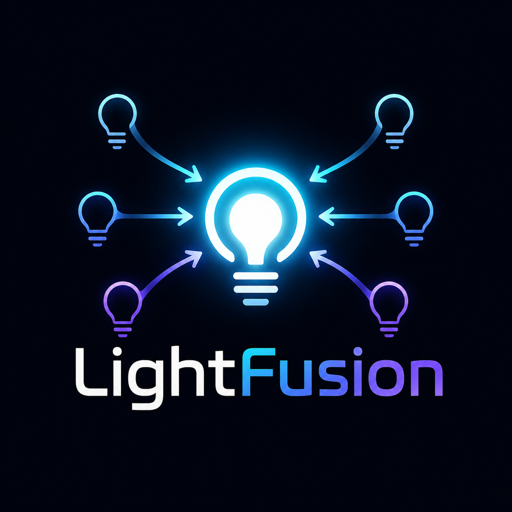

# LightFusion

  

LightFusion is an open-source lighting synchronization and calibration platform. Its first interface is a Homebridge plugin that provides unified HomeKit control of mixed-brand lights.

The project is designed to make lights from different manufacturers behave like one unified HomeKit lighting group, while correcting differences in color, brightness, and white temperature.

## Initial Device Support

- Philips Hue through the local Hue Bridge API
- Govee devices with LAN control
- Virtual HomeKit light controllers
- Raspberry Pi and standard Homebridge installations

## Current Features

- Unified on/off control across mixed-brand lights
- Synchronized brightness and color
- Synchronized white temperature
- Per-device color and brightness calibration
- Multiple configurable lighting groups
- Virtual HomeKit light controllers
- Homebridge custom configuration interface
- Automatic Philips Hue Bridge discovery
- Govee LAN device discovery
- Local network operation where supported
- Siri and Apple Home control

## Project Status

LightFusion is under active development. The core synchronization engine and Homebridge integration are functional and being expanded through real-world testing.

The initial implementation is being tested with:

- Philips Hue Bridge
- Philips Hue bulbs
- Philips Hue Play Light Bars
- Govee H60A1 ceiling light
- Homebridge running on Raspberry Pi
- Apple Home

## Creator

LightFusion was conceived, designed, and is maintained by  **@Drubular**.

Development includes AI-assisted architecture, coding, documentation, and testing workflows.

## License

Licensed under the MIT License.
